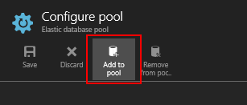

# TP - PaaS - Azure SQL Database

Avec ces didacticiels, vous allez apprendre à utiliser le Portail Azure pour :
•créer un serveur logique de base de données SQL pour héberger des bases de données SQL ;
•créer une base de données SQL sans données avec des exemples de données ou avec des données d’une sauvegarde de base de données SQL ;
•créer une règle de pare-feu au niveau du serveur pour une seule adresse IP ou une plage d’adresses IP.

## Prérequis

• Disposer d'un abonnement Azure
• Etre connecter au [portail azure](https://portal.azure.com/)
• Disposer des cmdlets [Powershell pour Azure](https://azure.microsoft.com/en-us/documentation/articles/powershell-install-configure/)

## Paramètres générales à utiliser
• Si aucune valeur n'est précisée, utiliser les valeurs par défaut proposées par le portail ou dans les scripts Powershell
• Nom du Resource Group : IPSSI-DEMO-RG
• Nom du serveur SQL : ipssi-demo-sql-server-(%poste%) ou %poste% correspond à votre numéro de poste
• Nom de la base de données : ipssi-demo-sql-db-1
• Elastic Pool Name : IPSSI-ElasticPool-1
• Location : North Europe

## Les tutoriaux à effectuer
### Portail Azure

1. [Créer un serveur SQL avec le portail Azure](https://azure.microsoft.com/fr-fr/documentation/articles/sql-database-get-started/)
• Pricing Tier : S0
2. [Créer un Pool Elastic avec le portail Azure](https://azure.microsoft.com/en-us/documentation/articles/sql-database-elastic-pool-create-portal/)
• pricing tier : Standard Pool
• Step 3, action 2, il ne faut pas cliquer sur **Add database**, mais sur Add To Pool

3. [Gérer et surveiller une base de données élastique avec le portail Azure](https://azure.microsoft.com/en-us/documentation/articles/sql-database-elastic-pool-manage-portal/#elastic-database-monitoring)

### Powershell
1. [Créer un serveur SQL avec Powershell](https://azure.microsoft.com/fr-fr/documentation/articles/sql-database-get-started/)
• Supprimer le Resource Group créé précédemment (toutes les ressources associées seront supprimées)
• S$DatabaseEdition = "Standard"
• S$DatabasePerfomanceLevel = "S0"
2. [Créer un Pool Elastic avec Powershell](https://azure.microsoft.com/en-us/documentation/articles/sql-database-elastic-pool-create-powershell/)
• Nom de la base de données qui sera créée de manière temporaire pour ce tutoriel : ipssi-demo-sql-db-2
3. [Gérer et surveiller un Pool Elastic avec Powershell](https://azure.microsoft.com/en-us/documentation/articles/sql-database-elastic-pool-manage-powershell/)
• Déplacer la database ipssi-demo-sql-db-1 dans le pool créé précédemment
